# BusyBar Ecosystem — Карта стейкхолдеров
**Дата:** 2026-04-08 | **Фреймворк:** theDots | **Шаг 1 — Big Picture**

---

## Основная проблема

> **Люди теряют контроль над своим вниманием.** Они не могут сигнализировать окружающим о своей занятости, не прерываясь для этого. Физическое и цифровое пространство не синхронизированы — статус "Do Not Disturb" в Slack не останавливает коллегу у стола, а открытая дверь не объясняет видеоколл ребёнку.

---

## Стейкхолдеры и их 3 главные проблемы

### 🧑‍💻 Focus Worker — Основной пользователь
*Специалист, работающий в режиме deep work: разработчик, дизайнер, писатель, аналитик*

| # | Проблема | Последствие |
|---|----------|------------|
| 1 | **Невидимая занятость** — нет физического сигнала о состоянии фокуса | Постоянные прерывания, которые стоят 23 минуты восстановления каждый раз |
| 2 | **Ручное переключение статусов** — обновить Slack, Teams, Zoom, календарь нужно отдельно | Статусы рассинхронизированы, "занят" в одном месте = "свободен" в другом |
| 3 | **Нет обратной связи о продуктивности** — непонятно, сколько реального фокус-времени было за день | Ощущение "был занят весь день, но ничего не сделал" |

---

### 👨‍👩‍👧 Семья / Партнёр дома
*Живут вместе с remote-работником, не понимают когда можно заходить и разговаривать*

| # | Проблема | Последствие |
|---|----------|------------|
| 1 | **Не знают, на звонке ли партнёр** — заходят в комнату в неподходящий момент | Неловкость, конфликты, ощущение "я мешаю" |
| 2 | **Нет способа сигнализировать срочность** — не могут сообщить что-то важное без прерывания | Либо ждут слишком долго, либо прерывают без необходимости |
| 3 | **Абстрактный "рабочий режим"** — непонятно, почему нельзя говорить, если человек просто сидит за компьютером | Трения в отношениях, особенно с детьми |

---

### 👥 Коллега в офисе / team member
*Работает рядом (open-space или hybrid), хочет обратиться с вопросом*

| # | Проблема | Последствие |
|---|----------|------------|
| 1 | **Нет сигнала о доступности** — непонятно, когда можно подойти и спросить | Либо прерывают в плохой момент, либо боятся обращаться вообще |
| 2 | **Slack-сообщение уходит в пустоту** — человек на звонке и не видит сообщений | Задержка ответа, потеря контекста |
| 3 | **Стеснение прерывать** — не хотят мешать, но не знают, когда уместно | Люди откладывают вопросы, что замедляет работу всей команды |

---

### 📊 Руководитель / Team Lead
*Управляет удалённой или гибридной командой, хочет понимать ритм работы*

| # | Проблема | Последствие |
|---|----------|------------|
| 1 | **Нет видимости фокус-времени команды** — непонятно, кто сейчас в deep work, кто доступен | Неловкое "когда можешь поговорить?" которое само по себе является прерыванием |
| 2 | **Культура постоянной доступности** — ожидание немедленного ответа убивает фокус команды | Выгорание, снижение качества работы |
| 3 | **Нет данных для ретроспективы** — как менялся фокус-ритм команды, где узкие места | Решения об организации работы принимаются вслепую |

---

### 🎥 Контент-мейкер / Стример
*Создаёт контент дома, работает по нерегулярному расписанию, живёт с другими людьми*

| # | Проблема | Последствие |
|---|----------|------------|
| 1 | **"В прямом эфире" непонятно снаружи** — родственники или сожители заходят в кадр во время стрима | Испорченный контент, публичное неловкое положение |
| 2 | **OBS / Streamlabs не сигнализируют физически** — красный индикатор видят только в интернете, не в комнате | Нет способа предупредить кроме стикера на двери |
| 3 | **Смена сцен не отражается нигде** — переход Recording→Live→Break визуально ничем не отмечен | Пропущенные важные моменты, неловкие появления в кадре |

---

### ⚙️ Разработчик / Maker (Open API)
*Технический пользователь, хочет интегрировать BUSY Bar в свой workflow или создать интеграцию*

| # | Проблема | Последствие |
|---|----------|------------|
| 1 | **Нет bridge между dev-инструментами и физическим миром** — CI/CD статус, PR-статус, деплой — всё в терминале | Приходится постоянно переключаться, чтобы понять "что сейчас происходит" |
| 2 | **Сложно создавать интеграции без хорошего SDK** — конкуренты либо закрытые, либо с примитивным API | Энтузиасты строят воркараунды вместо полноценных решений |
| 3 | **Нет community-маркетплейса** — свои интеграции негде опубликовать и монетизировать | Работа уходит в GitHub-репозитории без охвата и признания |

---

### 🖥️ IT Manager *(опциональный)*
*Управляет IT-инфраструктурой компании, принимает решение о закупках*

| # | Проблема | Последствие |
|---|----------|------------|
| 1 | **$249/устройство попадает в "серую зону" закупок** — слишком дорого для petty cash, слишком дёшево для formal RFP | Решение откладывается бесконечно |
| 2 | **Нет enterprise MDM / fleet management** — нельзя centrally manage 50+ устройств | Невозможно обоснованно закупить для всего офиса |
| 3 | **Неясная интеграция с Microsoft Teams Room** — корпоративный Teams и личный BUSY Bar не совпадают в roadmap | Риск несовместимости после крупной закупки |

---

### 🏠 Smart Home Enthusiast *(опциональный)*
*Строит умный дом на Home Assistant / Matter, хочет интегрировать BUSY Bar в автоматизации*

| # | Проблема | Последствие |
|---|----------|------------|
| 1 | **Нет нативной Matter-интеграции в конкурентах** — Luxafor, Kuando — USB-only | Приходится строить костыли через Raspberry Pi |
| 2 | **Статус рабочего режима не влияет на умный дом** — освещение, звук, дверной звонок продолжают мешать | Половина потенциала автоматизаций не реализована |
| 3 | **Нет стандарта "focus mode" в умном доме** — каждый делает своё решение | Время тратится на изобретение велосипеда |

---

## Кластеры проблем

### 🔴 Кластер A: "Невидимая занятость"
*Проблемы: Focus Worker #1, Семья #1, Коллега #1, Контент-мейкер #1*

**Корневая проблема:** Нет универсального физического сигнала о статусе доступности, понятного всем в реальном пространстве — независимо от экрана.

**Решение:** BUSY Bar как физический индикатор статуса + BUSY App как hub синхронизации всех цифровых статусов в один физический сигнал.

---

### 🟠 Кластер B: "Ручное управление вниманием"
*Проблемы: Focus Worker #2, Коллега #2, Контент-мейкер #3*

**Корневая проблема:** Статусы в разных инструментах не синхронизированы автоматически. Пользователь вынужден обновлять их вручную или выбирать один и игнорировать остальные.

**Решение:** Автоматическая синхронизация статуса из календаря, звонков и таймеров → в BUSY Bar, Slack, Teams, OBS одновременно.

---

### 🟡 Кластер C: "Слепые пятна продуктивности"
*Проблемы: Focus Worker #3, Руководитель #1, Руководитель #3*

**Корневая проблема:** Нет данных о реальном фокус-времени — ни у пользователя, ни у команды. Решения принимаются на основе ощущений, не фактов.

**Решение:** Автоматический учёт фокус-сессий → персональная аналитика + team dashboard для руководителей.

---

### 🟢 Кластер D: "Закрытая экосистема"
*Проблемы: Developer #1, Developer #2, Developer #3, Smart Home Enthusiast #1, #2*

**Корневая проблема:** Конкуренты — закрытые, статичные устройства. Нет открытого API, нет SDK, нет bridge к dev-инструментам и smart home.

**Решение:** HTTP API + TypeScript/Python SDK + Matter-интеграция + открытый маркетплейс анимаций и интеграций.

---

### 🔵 Кластер E: "Культура постоянной доступности"
*Проблемы: Руководитель #2, Коллега #3, Семья #2, Семья #3*

**Корневая проблема:** Нет инструмента для легитимации "я недоступен" без объяснений. Прерывание воспринимается как норма, а защита фокуса — как грубость.

**Решение:** Shared visibility + статусные страницы + "семейный режим" — BUSY Bar создаёт новый social contract вокруг внимания.

---

## Связи стейкхолдеров с продуктом

```mermaid
graph TD
    subgraph HARDWARE["🔴 BUSY Bar (устройство)"]
        LED[LED матрица\n Физический сигнал]
        TIMER[Таймер\n Pomodoro/Custom]
        WIFI[WiFi 6 + Matter\n Сетевое подключение]
    end

    subgraph SOFTWARE["🟠 BUSY App (программа)"]
        SYNC[Синхронизация\n статусов]
        ANALYTICS[Аналитика\n фокус-времени]
        INTEGRATIONS[Интеграции\n Cal, Slack, Teams]
        API[HTTP API\n + SDK]
    end

    FW["🧑‍💻 Focus Worker"]
    FAM["👨‍👩‍👧 Семья"]
    COL["👥 Коллега"]
    LEAD["📊 Руководитель"]
    STR["🎥 Стример"]
    DEV["⚙️ Developer"]
    SH["🏠 Smart Home"]

    FW -->|"Видит свой статус\n Кластер A+B"| LED
    FW -->|"Автостатус\n Кластер B"| SYNC
    FW -->|"Данные о фокусе\n Кластер C"| ANALYTICS

    FAM -->|"Понимает занятость\n Кластер A+E"| LED
    COL -->|"Знает когда подойти\n Кластер A"| LED
    COL -->|"Видит в Slack\n Кластер B"| SYNC

    LEAD -->|"Dashboard команды\n Кластер C"| ANALYTICS
    LEAD -->|"Культура фокуса\n Кластер E"| SYNC

    STR -->|"On Air индикатор\n Кластер A"| LED
    STR -->|"OBS-интеграция\n Кластер B"| INTEGRATIONS

    DEV -->|"CI/CD статус\n Кластер D"| API
    DEV -->|"Создаёт интеграции\n Кластер D"| API

    SH -->|"Home Assistant\n Кластер D"| WIFI
    SH -->|"Matter автоматизации\n Кластер D"| WIFI
```

---

## Приоритизация стейкхолдеров

| Стейкхолдер | Боль | Платит? | Можем сделать? | Приоритет |
|------------|------|---------|----------------|-----------|
| 🧑‍💻 Focus Worker | ⭐⭐⭐⭐⭐ | ✅ Да, $249 | ✅ Core | **P0** |
| 👨‍👩‍👧 Семья | ⭐⭐⭐⭐ | ➖ Косвенно | ✅ Через shared view | **P1** |
| 👥 Коллега | ⭐⭐⭐ | ➖ Косвенно | ✅ Team mesh | **P1** |
| ⚙️ Developer | ⭐⭐⭐⭐ | ✅ Pays in integrations | ✅ API First | **P1** |
| 📊 Руководитель | ⭐⭐⭐ | ✅ B2B потенциал | ⚠️ Dashboard нужен | **P2** |
| 🎥 Стример | ⭐⭐⭐ | ✅ Да, $249 | ✅ OBS интеграция | **P2** |
| 🏠 Smart Home | ⭐⭐ | ✅ Уже платит за Flipper | ✅ Matter | **P2** |
| 🖥️ IT Manager | ⭐⭐ | ⚠️ "Мёртвая зона" $249 | ❌ Сложно пока | **P3** |
