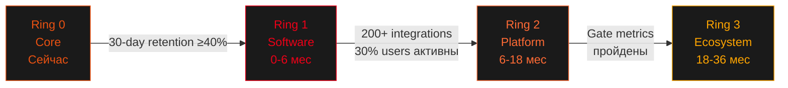

# BusyBar Ecosystem — Кольца расширения
**Дата:** 2026-04-08 | **Фреймворк:** theDots | **Шаги 2–3: Connect Dots → Shape Up**

---

## От кластеров проблем к кольцам стратегии

Каждый кластер из stakeholder map питает конкретное кольцо экосистемы:

| Кластер | Ключевые стейкхолдеры | → Кольцо |
|---------|-----------------------|----------|
| A: Невидимая занятость | Focus Worker, Семья, Коллеги, Стримеры | Ring 0 — Core |
| B: Ручное управление | Focus Worker, Коллеги, Стримеры | Ring 1 — Software Platform |
| C: Слепые пятна | Focus Worker, Руководители | Ring 1 — Software Platform |
| D: Закрытая экосистема | Developers, Smart Home | Ring 2 — Open Platform |
| E: Культура доступности | Руководители, Семья, Коллеги | Ring 2 — Open Platform |

---

## Диаграмма колец экосистемы

```
                         ┌─────────────────────────────────────────────┐
                         │  RING 3: Ecosystem Expansion (18-36 мес)    │
                         │  AI Focus Coach, New Hardware, Marketplace  │
                    ┌────┤─────────────────────────────────────────────┤────┐
                    │    │   RING 2: Open Platform (6-18 мес)          │    │
                    │    │   SDK, Matter, App Library, Team Mesh       │    │
                    │  ┌─┤─────────────────────────────────────────────┤─┐  │
                    │  │ │  RING 1: Software Platform (0-6 мес)        │ │  │
                    │  │ │  Integrations, Auto-Status, Analytics       │ │  │
                    │  │ │  ┌─────────────────────────────────────┐    │ │  │
                    │  │ │  │  RING 0: Core (Сейчас)              │    │ │  │
                    │  │ │  │  BUSY Bar + BUSY App Basic          │    │ │  │
                    │  │ │  └─────────────────────────────────────┘    │ │  │
                    │  │ └─────────────────────────────────────────────┘ │  │
                    │  └─────────────────────────────────────────────────┘  │
                    └─────────────────────────────────────────────────────────┘
```

---

## Ring 0 — Core (Сейчас)
*Устройство + базовое приложение*

**Что входит:**
- BUSY Bar: LED-матрица, таймер, WiFi 6, Matter-ready, HTTP API
- BUSY App: базовое управление цветом, таймер Pomodoro, ручное переключение статуса
- Прямая связь: нажатие кнопки = смена цвета

**Ценность:** *"Я занят" — теперь видно физически*

**Аудитория:** Focus Worker, Семья, первые Developers

**Метрика:** 8–15K units отгружено, 30-day app retention измеряется

**Слабое место:** Всё ручное — пользователь должен помнить включить/переключить

---

## Ring 1 — Software Platform (0–6 месяцев)
**⭐ ПРИОРИТЕТ #1 — Здесь максимальная ценность для пользователя**

*Software-first расширение без нового железа*

### Смысл Ring 1

Ring 1 = **Auto Presence**.  
Это не весь софт сразу. Это минимальная цепочка, после которой BUSY Bar работает "сам":

- понимает контекст через Calendar / calls
- синхронизирует статус
- вещает его в работу и домой
- не требует постоянного ручного участия

### Что строим:

#### 1.1 Умная синхронизация статусов (Кластер B)
- **Calendar Auto-Status:** Google Calendar + Outlook → если встреча, BUSY Bar автоматически меняет цвет
- **Video Call Detection:** Zoom/Teams/Meet запущен → автоматически "Do Not Disturb"
- **Slack/Teams Bidirectional Sync:** BUSY Bar ↔ Slack status (меняется с двух сторон)
- **Smart Transitions:** Встреча кончилась → 15 минут "cooling" → автоматически "доступен"

#### 1.2 Focus Analytics (Кластер C)
- **Daily Focus Map:** Тепловая карта дня — когда был в deep work, когда на звонках, когда доступен
- **Weekly Report:** Сколько часов фокуса, паттерны прерываний, лучшее время для deep work
- **Streak Tracking:** Серии продуктивных дней — gamification-элемент

#### 1.3 Family / Team Sharing (Кластер A + E)
- **Shared Status Page:** URL, который видит семья — простой индикатор "занят/свободен"
- **"Важно" Button:** Физическая кнопка на BUSY Bar → уведомление партнёру что "нужна помощь скоро"
- **Team Presence View:** Видеть статусы коллег в BUSY App (опционально, privacy-first)

#### 1.4 Desktop App (MacOS + Windows)
- Постоянное подключение к BUSY Bar без открытия браузера
- Menubar indicator, автозапуск, hotkeys
- Bridge между OS и устройством

### Ключевые интеграции Ring 1:
```
Google Calendar ──────┐
Outlook Calendar ─────┤
                       ├─→ BUSY App Hub ─→ BUSY Bar LED
Zoom / Meet ──────────┤       │
Microsoft Teams ───────┘       ├─→ Slack Status
                               ├─→ Teams Status
                               └─→ Shared Family URL
```

**Метрика успеха Ring 1:**
- 30-day retention ≥ 40%
- 60%+ пользователей подключили минимум 1 интеграцию
- 4.5+ stars в App Store / Google Play

---

## Ring 1.5 — Focus Memory (6–9 месяцев)
*Вторая подфаза после подтверждения Auto Presence*

### Что строим:
- App tracking во время BUSY-сессий
- Auto-timesheet
- Project tags
- Interruption Cost
- Daily Heatmap / Best Hours / Focus Score
- App blocking на macOS как should-have, не как core wedge

### Смысл Ring 1.5

Ring 1.5 = **Focus Memory**.  
После того как система стала надёжно отражать статус, она начинает объяснять, как реально проходил день.

Это отдельная подфаза, потому что:
- это уже не automation layer, а analytics layer
- здесь сложнее privacy и interpretation
- это не должно размывать core value Ring 1

---

## Ring 2 — Open Platform (6–18 месяцев)
*Платформа для разработчиков и умного дома*

### Смысл Ring 2

Ring 2 = **Open Platform**.  
Не "ещё больше личных фич", а превращение BUSY в расширяемую систему.

### Что строим:

#### 2.1 Developer Platform (Кластер D)
- **TypeScript SDK + Python SDK** с документацией и примерами
- **Developer Portal:** API docs, sandbox, showcase лучших интеграций
- **Webhook система:** BUSY Bar реагирует на GitHub PR, деплой, CI/CD статус
- **App Library v1:** Галерея community-интеграций с рейтингами

#### 2.2 Matter Full Support (Кластер D)
- **Home Assistant:** Нативная интеграция, BUSY Bar = устройство умного дома
- **Apple HomeKit / Google Home:** Через Matter протокол
- **Automation Recipes:** Готовые шаблоны: "встреча → приглуши свет + DND"

#### 2.3 Team Mesh (Кластер C + E)
- **Workspace Dashboard:** Руководитель видит агрегированный фокус-ритм команды
- **Focus Zones:** Запланированные блоки глубокой работы для команды
- **Meeting-free Windows:** Автоматическая защита фокус-времени команды

#### 2.4 Стример Kit (Кластер A)
- **OBS Studio Plugin:** Нативная интеграция — смена сцены → смена цвета BUSY Bar
- **Streamlabs Support**
- **BUSY Bar Studio Pack:** Предустановленные профили для стримеров

**Метрика успеха Ring 2:**
- 200+ apps в App Library
- 30% пользователей используют 1+ third-party интеграцию
- 5K+ GitHub stars для SDK

---

## Ring 2.5 — Team + AI-Adjacent (12–24 месяцев)

### Что строим:
- Slack Bot / busy-status / busy-when
- Team Dashboard и Focus Windows
- Time tracking exports / Toggl / Clockify / Harvest
- AI Agent Monitor

### Смысл Ring 2.5

Ring 2.5 = **workflow expansion**.  
Это не ещё AI Coach, а слой командных и новых AI-driven workflows, которые:
- не требуют длинной истории данных
- усиливают platform gravity
- создают мост в B2B и modern developer workflows

---

## Ring 3 — Ecosystem Expansion (18–36 месяцев)
*Расширение только после валидации Ring 1 + Ring 2*

### Смысл Ring 3

Ring 3 = **Intelligence + Identity + Expansion**.

Сюда входят только вещи, которым действительно нужен:
- data moat
- ecosystem scale
- installed base
- category trust

### Что возможно (при выполнении gate metrics):

#### 3.1 New Hardware
- **BUSY Bar Mini ($99–129):** Более доступная версия — расширение TAM
- **BUSY Bar Pro:** Для open-space офисов, larger display, enterprise features
- *(Только если Ring 1 метрики пройдены — не раньше)*

#### 3.2 AI Focus Coach
- Персональные рекомендации на основе накопленных данных
- "Сейчас лучшее время для deep work — у тебя 90 минут без встреч"
- Predicts focus windows на следующую неделю

#### 3.3 Marketplace
- Платные анимации от community artists
- Premium интеграции с revenue sharing
- BUSY Bar становится платформой, а не просто устройством

#### 3.4 Enterprise
- "BUSY for Teams" Slack Bot (бесплатный trojan horse)
- Team license ($15/user/month) с dashboard для руководителей
- *(Только если Flipper brand не является liability в enterprise)*

---

## Стратегическая логика



### Ключевой принцип: Software-First
> Каждое кольцо добавляет **программную ценность** к существующему железу. Новое железо — только Ring 3 и только после валидации.
>
> BUSY Bar — не устройство с приложением. BUSY Bar — **платформа управления вниманием**, у которой есть физический якорь.

---

## Позиционирование по кольцам

| Кольцо | Позиционирование | Конкуренты |
|--------|-----------------|------------|
| Ring 0 | "Физический индикатор занятости" | Luxafor Flag, Kuando Busylight |
| Ring 1 | "Умный центр управления вниманием" | Нет прямых конкурентов |
| Ring 2 | "Платформа для focus-автоматизаций" | Home Assistant (DIY), никто в категории |
| Ring 3 | "Focus Operating System" | Категория ещё не существует |
