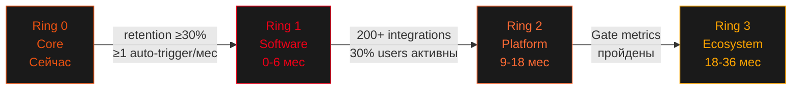

# BusyBar Ecosystem — Кольца расширения
**Дата:** 2026-04-08 | **Фреймворк:** theDots | **Шаги 2–3: Connect Dots → Shape Up**

---

## От кластеров проблем к кольцам стратегии

Каждый кластер из stakeholder map питает конкретное кольцо экосистемы:

| Кластер | Ключевые стейкхолдеры | → Кольцо |
|---------|-----------------------|----------|
| A: Невидимая занятость | Focus Worker, Семья, Коллеги, Стримеры | Ring 0 — Core |
| B: Ручное управление | Focus Worker, Коллеги, Стримеры | Ring 1 — Software Platform |
| C: Слепые пятна | Focus Worker, Руководители | Ring 1 — Software Platform |
| D: Закрытая экосистема | Developers, Smart Home | Ring 2 — Open Platform |
| E: Культура доступности | Руководители, Семья, Коллеги | Ring 2 — Open Platform |

---

## Диаграмма колец экосистемы

```
                         ┌─────────────────────────────────────────────┐
                         │  RING 3: Ecosystem Expansion (18-36 мес)    │
                         │  AI Focus Coach, New Hardware, Marketplace  │
                    ┌────┤─────────────────────────────────────────────┤────┐
                    │    │   RING 2: Open Platform (6-18 мес)          │    │
                    │    │   SDK, Matter, App Library, Team Mesh       │    │
                    │  ┌─┤─────────────────────────────────────────────┤─┐  │
                    │  │ │  RING 1: Software Platform (0-6 мес)        │ │  │
                    │  │ │  Integrations, Auto-Status, Analytics       │ │  │
                    │  │ │  ┌─────────────────────────────────────┐    │ │  │
                    │  │ │  │  RING 0: Core (Сейчас)              │    │ │  │
                    │  │ │  │  BUSY Bar + BUSY App Basic          │    │ │  │
                    │  │ │  └─────────────────────────────────────┘    │ │  │
                    │  │ └─────────────────────────────────────────────┘ │  │
                    │  └─────────────────────────────────────────────────┘  │
                    └─────────────────────────────────────────────────────────┘
```

---

## Ring 0 — Core (Сейчас)
*Устройство + базовое приложение*

**Что входит:**
- BUSY Bar: LED-матрица, таймер, WiFi 6, Matter-ready, HTTP API
- BUSY App: базовое управление цветом, таймер Pomodoro, ручное переключение статуса
- Прямая связь: нажатие кнопки = смена цвета

**Ценность:** *"Я занят" — теперь видно физически*

**Аудитория:** Focus Worker, Семья, первые Developers

**Метрика:** 8–15K units отгружено, 30-day app retention измеряется

**Слабое место:** Всё ручное — пользователь должен помнить включить/переключить

---

## Ring 1 — Software Platform (0–6 месяцев)
**⭐ ПРИОРИТЕТ #1 — Здесь максимальная ценность для пользователя**

*Software-first расширение без нового железа. macOS-only — Windows в Ring 2.*

### Смысл Ring 1

Ring 1 = **Auto Presence**.  
Это минимальная цепочка, после которой BUSY Bar работает "сам":

- понимает контекст через Calendar / calls / запущенные приложения
- синхронизирует статус
- вещает его в работу и домой
- не требует постоянного ручного участия

**Бизнес-модель:** Free tier (auto-presence базовый) + **BUSY Pro $4.99/мес** (аналитика, Focus Memory, история, AI-расширения). Цель: 5–10% конверсии.

**72-hour rule:** каждый touchpoint Ring 1 должен доставлять видимую ценность в первые 72 часа. Anxiety ("гаджет будет пылиться") — главный блокер adoption по всем сегментам. Первый auto-trigger должен произойти до конца первого рабочего дня.

**Passive adoption loop:** каждый покупатель создаёт 3–5 пассивных пользователей бесплатно — Family через URL, Colleagues через Slack sync. Это не side effect — это основной growth механизм.

### Что строим:

#### 1.1 Умная синхронизация статусов (Кластер B)
- **Calendar Auto-Status:** Google Calendar → если встреча, BUSY Bar автоматически меняет цвет
- **Video Call Detection:** Zoom / Google Meet запущен → автоматически "Do Not Disturb"
- **Slack Bidirectional Sync:** BUSY Bar ↔ Slack status (меняется с двух сторон)
- **Smart Transitions:** Встреча кончилась → 15 мин "cooling" → автоматически "доступен"

#### 1.2 Smart Focus Intent — AI (Кластер B)
- **On-device AI:** детектирует рабочий контекст из запущенных приложений (редактор / IDE открыт, нет активных звонков ≥ 90 мин)
- **Auto-suggestion:** предлагает или включает фокус-режим — без встречи в календаре
- **Расширяет auto-presence:** покрывает сценарий deep work без calendar-события
- **Privacy-first:** всё локально, ничего не отправляется. Работает с первого дня без истории

#### 1.3 Family Sharing (Кластер A)
- **Shared Status Page:** URL, который видит семья — простой индикатор "занят/свободен"
- **"Важно" Button:** кнопка на BUSY Bar → тихое уведомление партнёру

#### 1.4 macOS Desktop App
- Постоянное подключение к BUSY Bar без открытия браузера
- Menubar indicator, автозапуск, hotkeys
- Bridge между macOS и устройством

### Ключевые интеграции Ring 1:
```
Google Calendar ──────┐
                       ├─→ BUSY macOS App ─→ BUSY Bar LED
Zoom / Meet ──────────┤       │
App Context (AI) ─────┘       ├─→ Slack Status
                               └─→ Shared Family URL
```

**Метрика успеха Ring 1:**
- 30-day retention ≥ 30% (retention = устройство в WiFi + ≥1 auto-trigger за 30 дней)
- 60%+ пользователей подключили минимум 1 интеграцию
- Pro конверсия цель: 5% к моменту Ring 1.5 launch

---

## Ring 1.5 — Focus Memory (6–9 месяцев)
*Вторая подфаза после подтверждения Auto Presence*

### Смысл Ring 1.5

Ring 1.5 = **Focus Memory** — ядро BUSY Pro подписки.  
После того как система надёжно отражает статус, она начинает объяснять, как реально проходил день.

### Что строим:
- **Focus Analytics:** Daily Heatmap, Focus Score, Best Hours, Weekly Streak
- App tracking во время BUSY-сессий (трекинг только когда девайс "занят")
- Auto-timesheet с разбивкой по приложениям
- Project tags / project context
- Interruption Cost — стоимость прерываний в реальном времени
- App blocking на macOS (через Focus Modes API) — защита от внешних прерываний
- **AI Agent Monitor** (Ring 1.5, не Ring 3): Claude Code / Copilot / Cursor активен → BUSY Bar физически сигнализирует. Джоб появился сейчас — окно захвата нарратива закроется к 2027

Это отдельная подфаза, потому что:
- другой слой ценности: не "система работает сама", а "система помогает понять мой день"
- analytics усиливает BUSY Pro — платная фича, видная каждый день
- не должно размывать core value Ring 1

---

## Ring 2 — Open Platform (6–18 месяцев)
*Платформа для разработчиков и умного дома*

### Смысл Ring 2

Ring 2 = **Open Platform**.  
Не "ещё больше личных фич", а превращение BUSY в расширяемую систему.

### Что строим:

#### 2.1 Developer Platform (Кластер D)
- **TypeScript SDK + Python SDK** с документацией и примерами
- **Developer Portal:** API docs, sandbox, showcase лучших интеграций
- **Webhook система:** BUSY Bar реагирует на GitHub PR, деплой, CI/CD статус
- **App Library v1:** Галерея community-интеграций с рейтингами

#### 2.2 Matter Full Support (Кластер D)
- **Home Assistant:** Нативная интеграция, BUSY Bar = устройство умного дома
- **Apple HomeKit / Google Home:** Через Matter протокол
- **Automation Recipes:** Готовые шаблоны: "встреча → приглуши свет + DND"

#### 2.3 Slack Bot (Trojan Horse)
- **BUSY for Teams Slack Bot** (бесплатный): `/busy-status`, `/busy-when @user`
- Работает для всех коллег — у кого нет BUSY Bar тоже видит статусы тех, у кого есть
- Механизм: каждый Focus Worker создаёт 3–5 пассивных пользователей в Slack-контексте без продаж
- **Surveillance принцип:** полный Team Dashboard — Ring 3. Риск perception как surveillance убивает доверие у обоих: Focus Worker и Team Lead

#### 2.4 Стример Kit (Кластер A)
- **OBS Studio Plugin:** Нативная интеграция — смена сцены → смена цвета BUSY Bar
- **Streamlabs Support**
- **BUSY Bar Studio Pack:** Предустановленные профили для стримеров

**Метрика успеха Ring 2:**
- 200+ apps в App Library
- 30% пользователей используют 1+ third-party интеграцию
- 5K+ GitHub stars для SDK

---

## Ring 3 — Ecosystem Expansion (18–36 месяцев)
*Расширение только после валидации Ring 1 + Ring 2*

### Смысл Ring 3

Ring 3 = **Intelligence + Identity + Expansion**.

Сюда входят только вещи, которым действительно нужен:
- data moat (90+ дней персональных паттернов)
- ecosystem scale (тысячи устройств в сети)
- installed base + category trust

### Что возможно (при выполнении gate metrics):

#### 3.1 AI Focus Coach
- Персональные рекомендации на основе накопленных данных
- "Сейчас лучшее время для deep work — у тебя 90 минут без встреч"
- Predicts focus windows на следующую неделю

#### 3.2 Team + B2B Layer
- "BUSY for Teams" Slack Bot (бесплатный trojan horse): `/busy-status`, `/busy-when @user`
- Team Dashboard для руководителя (aggregate focus view, privacy-first)
- Focus Windows: запланированные тихие часы для команды
- Team license ($15/user/month) после органического роста

#### 3.3 AI Agent Monitor
- Claude Code / Codex / CLI hooks → физический статус BUSY Bar
- "Агент работает" как отдельный режим индикации

#### 3.4 New Hardware
- **BUSY Bar Mini ($99–129):** Более доступная версия — расширение TAM
- *(Только если Ring 1 метрики пройдены — не раньше)*

#### 3.5 Marketplace
- Платные анимации от community artists
- Premium интеграции с revenue sharing

#### 3.6 ADHD Expansion
- HSA/FSA eligibility исследование
- Focusmate / body-doubling интеграция

---

## Стратегическая логика



### Ключевой принцип: Software-First
> Каждое кольцо добавляет **программную ценность** к существующему железу. Новое железо — только Ring 3 и только после валидации.
>
> BUSY Bar — не устройство с приложением. BUSY Bar — **платформа управления вниманием**, у которой есть физический якорь.

---

## Позиционирование по кольцам

| Кольцо | Позиционирование | Конкуренты |
|--------|-----------------|------------|
| Ring 0 | "Физический индикатор занятости" | Luxafor Flag, Kuando Busylight |
| Ring 1 | "Умный центр управления вниманием" | Нет прямых конкурентов |
| Ring 2 | "Платформа для focus-автоматизаций" | Home Assistant (DIY), никто в категории |
| Ring 3 | "Focus Operating System" | Категория ещё не существует |
